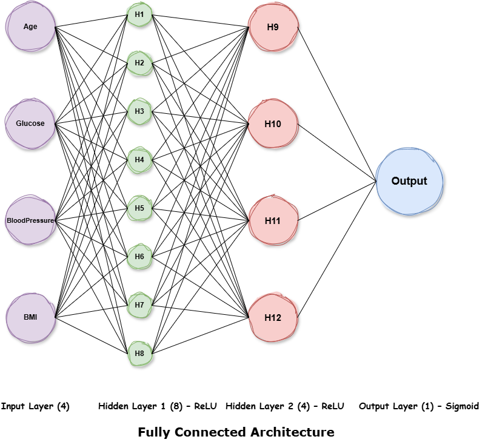
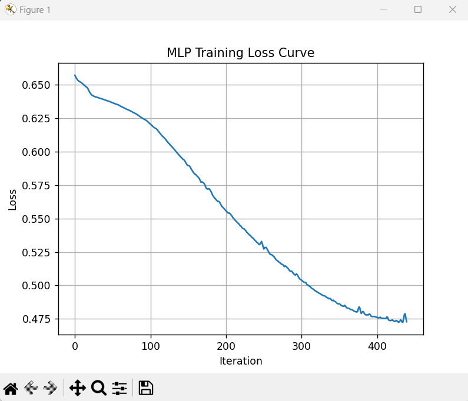

# FPGA-Based MLP Diabetes Classifier

This project presents an end-to-end implementation of a Multilayer Perceptron (MLP) neural network for diabetes classification, deployed on FPGA using Verilog.

The model is trained in Python, weights are extracted and converted into fixed-point format, and inference is implemented in hardware.

---

## Project Overview

- Dataset: Pima Indians Diabetes Dataset
- Input Features: Glucose, BloodPressure, BMI, Age
- Architecture: 4–8–4–1 MLP
- Activation Functions: ReLU (hidden layers), Sigmoid (output)
- Train/Test Split: 80% / 20%
- Test Accuracy: ~75%+
- Hardware Language: Verilog
- Number Representation: Fixed-Point (scaled by 256)

---

## Neural Network Architecture

The implemented network is fully connected and consists of:

- 4 input neurons  
- Hidden Layer 1: 8 neurons (ReLU)  
- Hidden Layer 2: 4 neurons (ReLU)  
- Output Layer: 1 neuron (Sigmoid)  

### Architecture Diagram

  

---

## Model Training

- Implemented in Python  
- Data normalized to range [0, 1]  
- Optimizer: Adam  
- Loss Function: Binary Cross-Entropy  

The training process showed stable convergence, as illustrated below.

### Training Loss Curve

  

The decreasing loss confirms that the model successfully learned from the data and converged during training.

---

## Fixed-Point Conversion

To enable efficient FPGA implementation:

- Floating-point weights were multiplied by 256  
- Converted to signed integers  
- Scaling handled during hardware computation  

This reduces hardware complexity and FPGA resource usage.

---

## Hardware Implementation

- Each layer implemented as a separate Verilog module  
- Operations include Multiply-Accumulate (MAC), bias addition, and activation  
- Designed for inference only  

The hardware output was verified against Python inference results and showed close agreement.

---

## Conclusion

This project demonstrates how a machine learning model trained in software can be successfully transferred to hardware using fixed-point arithmetic, bridging AI development and digital design on FPGA.
